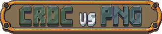
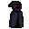
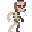

<h2 align="center">
  
  
  <i>A UP Cebu - CMSC 137 Project (c) 2023</i>
</h2>

##  TABLE OF CONTENTS
- [ TABLE OF CONTENTS](#-table-of-contents)
- [ INTRODUCTION](#-introduction)
- [ INSTALLATION AND UNINSTALLATION](#-installation-and-uninstallation)
- [ HOW TO PLAY THE GAME](#-how-to-play-the-game)

##  INTRODUCTION
CROC vs PNG is a game created to showcase BSCS IV students for their Data Communications and Networking course. The game should have the capability to connect and communicate with other computers as the game progresses. This game is inspired by the <i></i> game mode from .

In the game, the players battle and defend themselves from waves of Phantom Naz Ghouls (PNGs) and prevent them from killing the players and reaching their goal. The enemy's goal is to destroy the Central Resistance against Otherworldly Creatures (CROC) facility. The game ends either when the facility is destroyed by the enemy, or the CROCs emerge victorious and successfully fend off the waves of PNGs.

---

⚠️ **Warning:** If any bugs are discovered in the game that were not identified during playtesting, I sincerely apologize. Regrettably, I won't be able to address or continue development for this game beyond 12/11/2023. Your understanding is greatly appreciated.

‼️**NOTE**: Although the game is designed for multiplayer sessions, please be aware that this game exclusively relies on LAN and **does not** incorporate any online features. In line with this, if a new player decides to join the game while there is an ongoing game, they won't be able to do so. They can click the `Join` button on the server, but this will give the host and the already connected clients syncing errors. This limitation stems from the code's design, and regrettably, I haven't come across suitable documentation or tutorials to resolve this issue. There is also no more time for further research and development. Should you wish to include another player, restarting the host instance is the necessary course of action.

---

##  INSTALLATION AND UNINSTALLATION

### For installation

1) Check the [latest](https://github.com/naixsu/CROCPNG/releases/tag/v1.0.4) release branch and download the zip file depending on your OS.
2) You can also download them through here for [Windows](https://github.com/naixsu/CROCPNG/releases/download/v1.0.4/Windows.zip), [Linux](https://github.com/naixsu/CROCPNG/releases/download/v1.0.4/Linux.zip), and [Mac](https://github.com/naixsu/CROCPNG/releases/download/v1.0.4/Mac.zip).
3) For Windows, launch the game using the `crocpng.exe` file. For Linux, launch the game using the `crocpng.x86_64` file. For Mac, launch the game using the `CROCPNG` file.
4) If your computer is preventing the app from running, just ignore it. I swear it's not a virus, I just don't have a developer certificate.
5) Enjoy!

### For uninstallation
It's pretty simple. Just delete the files that you installed. This game doesn't have any file saving/manipulation so no new files are created and stored in your machine when running the game.

##  HOW TO PLAY THE GAME

While the main menu already provides instructions, allow me to reiterate the steps to get you started:
1) On the main menu, you'll find several buttons.
2) `Host` turns your game into the host. Given that this project is designed for our Data Communications and Networking course, having at least one host is crucial. After clicking `Host`, you have two options:
   - For single player experience, press the `Start` button.
   - For a multiplayer session, wait for other players to join your lobby. Connected players are displayed in the logs (the gray square area). Once all players are present, either you or any lobby participant can initiate the game by pressing the `Start` button.
3) `Find Servers` relinquishes your host privileges, allowing you to search for an available server. When a server is located, it will be listed in the logs (the gray square area) along with relevant information and a `Join` button.
4) `Join` button is exclusively for clients (non-hosts) and facilitates joining the host's server.
5) `Start` commences the game and can be triggered by both hosts and clients.
6) If you seek further guidance, the `Tutorial` option provides a brief overview of the gameplay and its features.
7) Should you wish to host in the console, simply run the console file in the CLI and add `--headless --server "<server-name>"`

